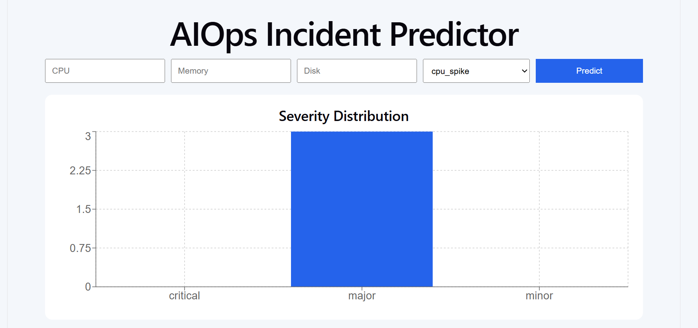
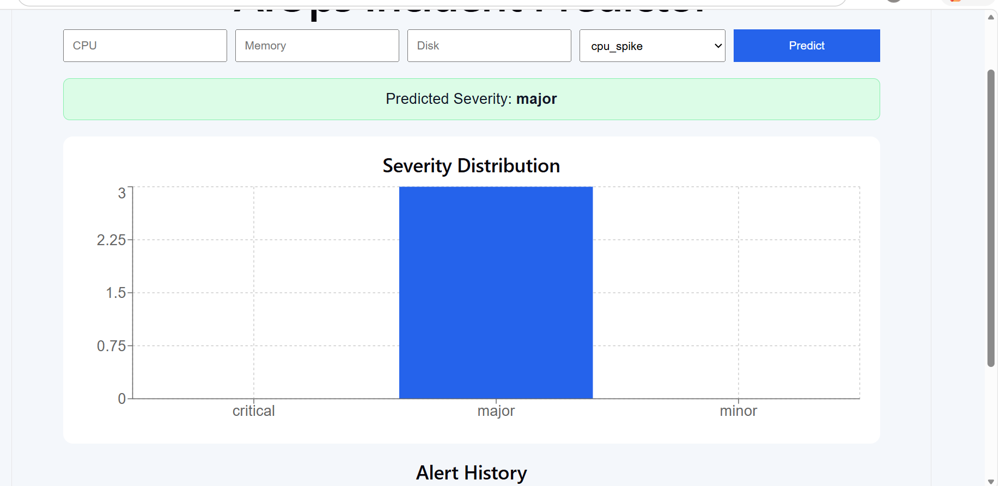
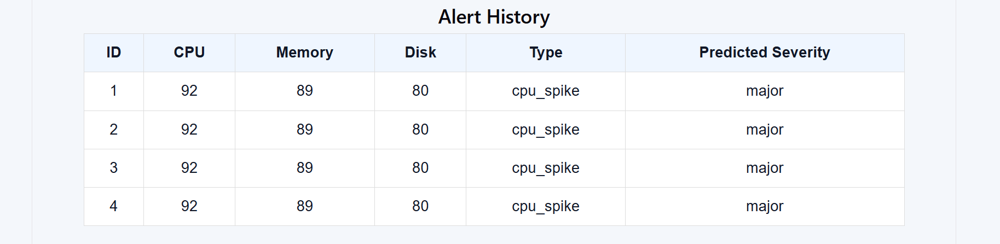

# AIOps Incident Predictor

A full-stack AIOps project built with React, FastAPI, and Machine Learning to predict alert severity and visualize incidents.

## Features
- Predict alert severity using a trained ML model
- Store alert history in SQLite
- React dashboard for entering alerts and viewing predictions
- Severity distribution chart
- Backend APIs with FastAPI

## Tech Stack
- Frontend: React, Axios, Recharts
- Backend: FastAPI, SQLAlchemy
- ML: scikit-learn, pandas, joblib
- Database: SQLite
- Tools: Git, GitHub, Vite

## Project Structure
- `backend/` FastAPI backend and ML model
- `frontend/` React frontend

## How to Run

### Backend
```bash
cd backend
venv\Scripts\python.exe train_model.py
venv\Scripts\python.exe -m uvicorn main:app --reload

## Screenshots

### Dashboard


### Prediction Result


### alerthistory
